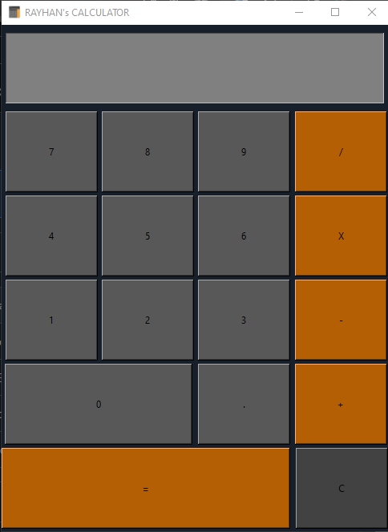

# Rayhan's Calculator

This is a simple calculator application developed using Python's Tkinter library. It allows users to perform basic arithmetic operations such as addition, subtraction, multiplication, and division. 

## Features

- User-friendly interface with buttons for numbers and operators.
- Input box to enter the expression.
- Clear button (C) to clear the input.
- Equal (=) button to evaluate the expression and display the result.
- Supports basic arithmetic operations: addition (+), subtraction (-), multiplication (*), and division (/).
- Error handling for invalid expressions.

## Usage

1. Enter the expression using the number buttons and operators.
2. Press the '=' button to see the result.
3. Use the 'C' button to clear the input and start over.

## screenshot



# How To Download?

```bash
git clone https://github.com/TheRayhan009/calculetor_app_tkinter

```
